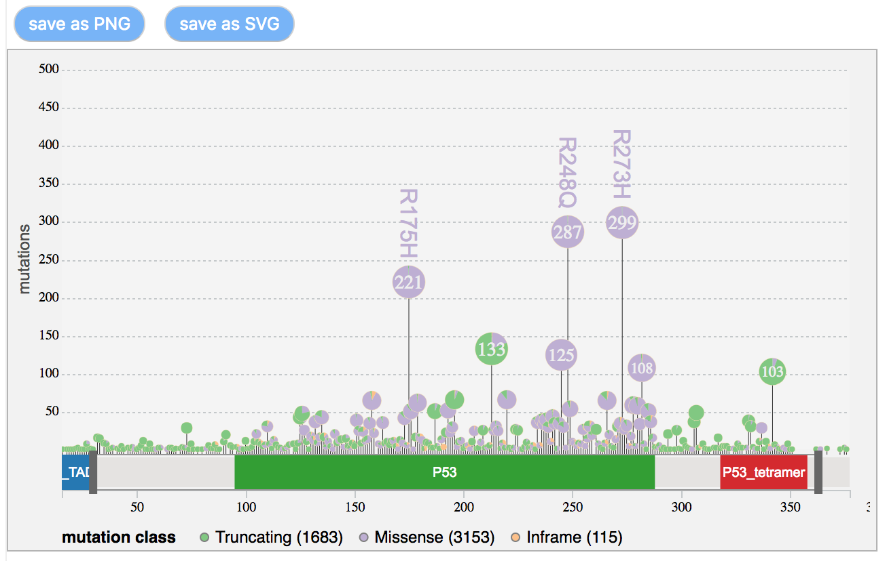

# lollipop.js

`lollipop.js` is Javascript library to visualize genmomic mutations using a *loliipop* diagram

## Usage

The input of takes annotated 
<a href="https://docs.gdc.cancer.gov/Encyclopedia/pages/Mutation_Annotation_Format/">MAF (Mutation Annotation Format)</a> or TSV (tabular-separated values) files as inputs, and generates an interactive 'lollipop-style' diagram to allow users to easily visualize every details of genomic mutations.

## Examples

<a href="https://bl.ocks.org/phoeguo/583a12e04c6b9d7ca1825cdbdc62f531"></a>

## Features

- Rich chart options
- Interactive chart legend
- Zoom/brush to view data details
- Save charts in SVG/PNG format
- Over 30 color schemes

## Usage

### Add libraries
```html
<!-- add CSS -->
<link rel="stylesheet" href="https://s3-us-west-2.amazonaws.com/cdsjsd3/css/g3-lollipop.min.css">

<!-- D3 and G3-lollipop libraries -->
<script src="https://d3js.org/d3.v4.min.js"></script>
<script src="https://s3-us-west-2.amazonaws.com/cdsjsd3/js/g3-lollipop.min.js"></script>
```

### Input data
The input data includes annotated mutation data (in <a href="https://docs.gdc.cancer.gov/Data/File_Formats/MAF_Format/">MAF</a> or user-defined tab-delimited file.  For either formats, the file is required to contain some mandatory columns as listed

Column | Description | Examples
| ------- | ------------- | -------- |
| **Hugo_symbol** | HUGO symbol | TP53, BRCA1 |
| **Amino_acid_change** | Amino Acid change | A915D, T3085fs | 
| **Variant_Classification** | translational effects of mutations | Missense_Mutation, Frame_Shift_Ins |
| **Chromosome** | Chromosome | chr1, chrX |
| **Start_position** | mutation start position | 133647184 |
| **End_position** | mutation end position | 133647185 |

### *Variant_Classification* to *Variant_type*

An example of Mutation data in tab-delimited format

Protein_Change | Mutation_Type | Mutation_Class | AA_Position
| ------------- |------------- | ----- |  ---- |
| P13Lfs*2 | Frame_Shift_Del |Truncating | 13 |
| L14Sfs*15 | Frame_Shift_Ins | Truncating | 14 |
| Q16Rfs*28 | Frame_Shift_Del | Truncating | 16 |
| T18Hfs*26 | Frame_Shift_Del | Truncating | 18 |
| F19Kfs*24 | Frame_Shift_Del | Truncating | 19 |
| S20Qfs*24 | Frame_Shift_Del | Truncating | 20 |
| ... | ... | ... | ... | 

- Protein domain information (in JSON format)

```JSON
{  
   "hgnc_symbol":"TP53",
   "protein_name":"tumor protein p53",
   "uniprot_id":"P04637",
   "length":393,
   "pfam":[  
      {  
         "pfam_ac":"PF08563",
         "pfam_start":6,
         "pfam_end":29,
         "pfam_id":"P53_TAD"
      },
      {  
         "pfam_ac":"PF00870",
         "pfam_start":95,
         "pfam_end":288,
         "pfam_id":"P53"
      },
      {  
         "pfam_ac":"PF07710",
         "pfam_start":318,
         "pfam_end":358,
         "pfam_id":"P53_tetramer"
      }
   ]
}
```

- Data configuration

```javascript
var snvDataFormat = {
    x: "AA_Position",          // mutation position
    y: "Protein_Change",       // protein change type
    factor: "Mutation_Class",  // (optional) if mutations are classified by cetern categories
};

var domainDataFormat = {
    domainType: "pfam",       // key to the domain annotation entries
    length: "length",         // protein length
    details: {
        start: "pfam_start",  // protein domain start position
        end: "pfam_end",      // protein domain end position
        name: "pfam_id",      // protein domain name
    },
};
```

- Create lollipop chart

```javascript
// new lollipop chart
lollipop = g3.Lollipop("g3chart");

// add data
lollipop.data.snvData = snvData;
lollipop.data.domainData = domainData;

// specify data format
lollipop.format.snvData = snvDataFormat;
lollipop.format.domainData = domainDataFormat;

lollipop.draw();
```

## API
